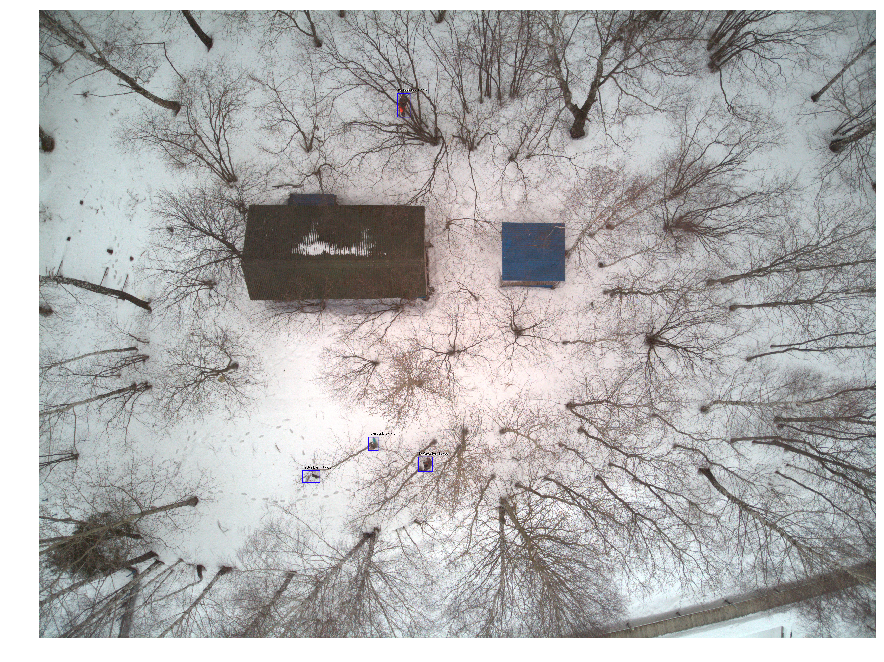
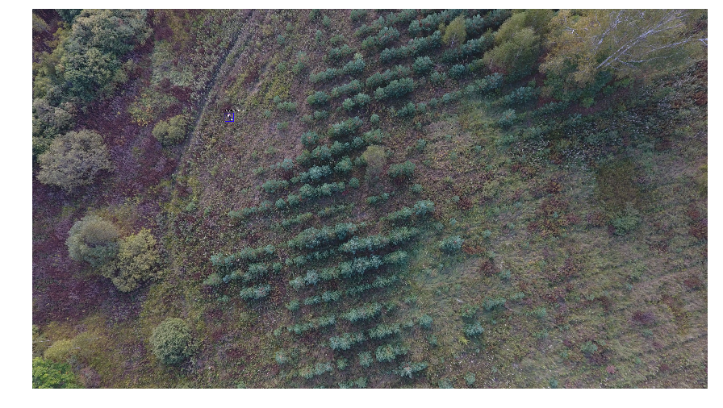

# rescuer-la

The program for searching through photos from the air of lost people in the forest. 

The project is being developed by a non-profit organization Liza Alert.

## Demonstration

*Picture 1*

*Picture 2*

*Vidio 1*

See [more examples](docs/work-demo.md).

## Training data

You can download `Liza Alert Drone Dataset` [here](https://yadi.sk/d/4Hz_1qpiNbHhpQ)

## Usage

Read this [train documentation](docs/train-usage.md) to learn how to train the model.

## Pretrained models

The models are avalable [here](https://github.com/gosha20777/rescuer-la/releases)
