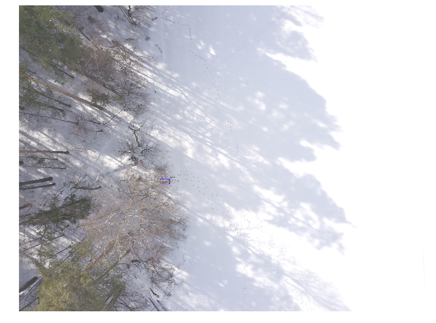

# Lacmus Drone Dataset (LADD)

LADD is a dataset of drone created images for pedestrian detection. LADD annotations are into VOC format. 

You can [download the LADD](https://cloud.mail.ru/public/2k53/2bJVwYSa7) from Mail.Cloud directly. 

#### Overview of dataset

* You can see a example of the labeled  image.

  We have just one kind of label :

  * 0 - Pedestrian

  


* The structure of the `LADD_VERSION_SIZON`

  ```
  ├── LADD
  │   ├── Annotations
  │   │   └── X.xml (419 items)
  │   ├── examples
  │   │   └── X.jpg (10 items)
  │   ├── ImageSets
  │   │   └── Main 
            # *.txt which split the dataset
  │   │       └──  test.txt
  │   │       └──  train.txt
  │   │       └──  trainval.txt
  │   │       └──  val.txt
  │   └── JPEGImages
  │       └── X.jpg (419 items)

  ```

* The  `JPEGImages`:

  * **Image Type** : *jpeg(JPEG)*
  * **Width** x **Height** : *4000 x 3000*

* The `Annotations` : The VOC format `.xml` for Object Detection, automatically generate by the label tools. Below is an example of `.xml` file.

```xml
<annotation>
    <folder>VocGalsTfl</folder>
    <filename>0</filename>
    <source>
        <database>Unknown</database>
    </source>
    <size>
        <width>4000</width>
        <height>3000</height>
        <depth>3</depth>
    </size>
    <segmented>0</segmented>
    <object>
        <name>Pedestrian</name>
        <pose>Unspecified</pose>
        <truncated>0</truncated>
        <difficult>0</difficult>
        <bndbox>
            <xmin>1881</xmin>
            <ymin>1409</ymin>
            <xmax>1905</xmax>
            <ymax>1469</ymax>
        </bndbox>
    </object>
    <object>
        ...
    </object>
</annotation> 
```

The dataset is divided into 3 seasons: **summer**, **spring** and **summer**. All files are stored in archives `LADD_VERSION_SIZON_NUMBER` and are numb. You can independently collect your dataset. To do this, simply merge the corresponding folders and contents of text files into one.

You can also use our official tools.

## License

LADD is licensed under GNU General Public License v3.0. You can read the license text [here](https://github.com/lizaalert/lacmus/blob/master/LICENSE). 

This license applies not only to the dataset, but also to ALL SOFTWARE products that use it to one degree or another.

