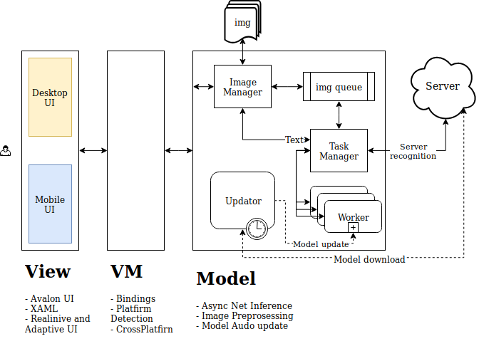
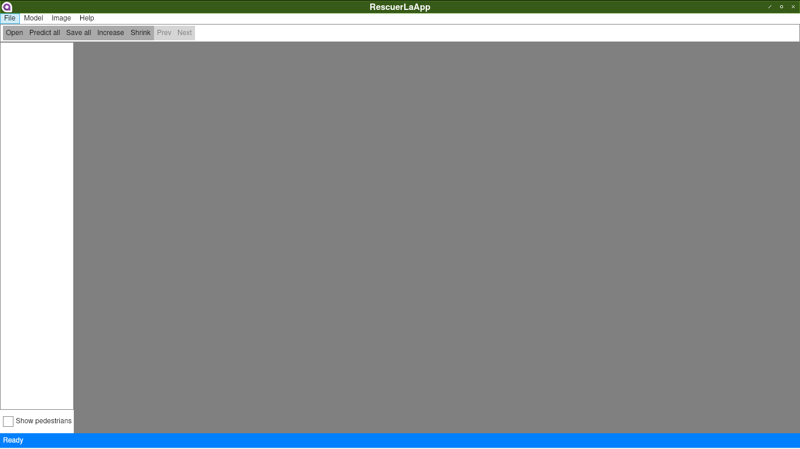

# Lacmus

### SOFTWARE REQUIREMENTS SPECIFICATION ISO-IEEE-29148-2011

Основные сокращения:
- БПЛА - беспилотный летательный аппарат;

## 1. Назначение ПО — поиск пропавших людей на местности
Основные функции ПО:

- сбор и хранение фотографий местности в базе данных;
- формирование датасета для тренировки нейросетей;
- поиск людей на фотоснимках местности, сделанных с помощью беспилотных летательных аппаратов (БПЛА).

## 2. Область применения
#### 2.1 Имя ПО, по которому его можно будет отличить от других программ - **Lacmus**

#### 2.2 Общая логика работы Lacmus

1. Оператор определяется участок местности, в котором будет осуществляться поиск пропавшего человека и запускает БПЛА в соответствии с подготовленным маршрутом.

2. БПЛА осуществляет фото съемку и передает информацию на локальную машину оператора (ноутбук) с установленным ПО Lacmus (RescuerLaApp).

3. С локальной машины полученные снимки отправляются на виртуальный сервер (docker service), который обрабатывает снимки с помощью нейросети. В случае обнаружения человека на снимке делается отметка в виде прямоугольника.

#### 2.3 Описание области применения ПО, вкл. относительные преимущества, объекты автоматизации и цели ПО

На сегодняшний день обработка снимков с БПЛА при поиске людей осуществляется в основном операторами вручную, что получается долго и не очень точно. Неплохие результаты получаются при обработке снимков с тепловизоров, однако они имеют довольно высокую стоимость и большие затраты энергии, что снижает время полета.

Основные преимущества Lacmus (RescuerLaApp) - это возможность свободного использования для поиска людей на снимках, сделанных в видимом диапазоне с помощью относительно недорогих моделей БПЛА. Применение RescuerLaApp в некоммерческом проекте Liza Alert позволит повысить шансы отыскания и сократить время на обнаружение пропавшего человека. Важно! Lacmus не должен применяться в военных или иных целях, направленных на причинение вреда жизни или здоровью людей.

#### 2.4 Взаимосвязь ПО с требованиями на более общих уровнях системы, в которой оно будет работать

Более общие требования к системе не определены.

## 3. Обзор ПО

#### 3.1 Системный интерфейс

Общая структура системы и указание функций ПО, обеспечивающих связь между элементами приведена на рисунке 1.

#### 3.2 Пользовательские интерфейсы

а) Логика работы интерфейса пользователя.

Интерфейс пользователя изображен на рисунке 2

Интерфейс пользователя состоит из следующих элементов:

MenuBar (Стандарное меню приложения):

File (Операции с файлами изображений):
- Open directory - открывает окно выбора рабочей директории с изображениями;
- Predict all - проводит обработку всех снимков в выбранной директории;
- Save  - сохраняет обработанные изображения;
- Show all - ???
- Exit - Закрывает приложение.

Model (Операции с нейросетевой моделью):
- Load Model - загрузить модель на локальную машину;
- Update Model - обновить модель (синхрозация с сервером).

Image (Операции с изображениями):
- Predict this - обработать текущее выделенное изображение;
- Predict all - обработать все изображения в рабочей директории;
- Increase - увеличить масштаб изображения;
- Shrink - уменьшить масштаб изображения;
- Next - выбрать следующее изображение;
- Prev - выбрать предыдущее изображение.

Help:
- Open user guide - открыть руководство пользователя;
- About - вывести окно с информацией о текущей версии приложения.

ToolBar:
- Open - открывает окно выбора рабочей директории с изображениями;
- Predict all - проводит обработку всех снимков в выбранной директории;
- Increase - увеличить масштаб изображения;
- Shrink - уменьшить масштаб изображения;
- Next - выбрать следующее изображение;
- Prev - выбрать предыдущее изображение.

ImageArea: Область для показа текущего выбранного изображения.

ShowPedestriansCheckBox: Опция выбора отображения найденных людей.

StatusBar: Информация о текущем статусе приложения.

б) Аспекты взаимодействия приложения, пользователя и администратора.
(В простом случае это может быть просто список разрешенных и не разрешенных действий для пользователя. Более подробно эти аспекты могут описываются в Техническом описании и/или Руководстве пользователя.)

#### 3.3 Аппаратные интерфейсы

Передача изображений с БПЛА на локальную машину может осуществляться с помощью съемного носителя (USB или SD карты). В перспективе возможна передача видео по радиоканалу (Wi-Fi) и обработка в реальном времени.

#### 3.4 Программные интерфейсы:

Для работы приложения обязательно нужен установленный docker-ce. Все зависимости (ОС, СУБД, вычислительные пакеты) уже включены в контейнер. Список зависимостей можно посмотреть в файле Dockerfile.

#### 3.5 Интерфейсы связи
Так как исследования по улучшению нейросетевых моделей находятся в активной фазе, для работы приложения обязательно наличие доступа в Интернет для загрузки актуальной версии docker-контейнера c упакованной обученной нейросетью.

#### 3.6 Ограничение на использование памяти
Отдельные ограничения на занимаемый объем ПО и количество потребляемой памяти - не более 2 Гб.

#### 3.7 Операции:

- перенос файлов с накопителя БПЛА на локальную машину;  
- выбор рабочей директория с изображениями;  
- создание защищенного соединения с сервером через интернет, авторизация
- загрузка файла нейросетевой модели на локальную машину;  
- запуск docker service на локальном хосте;  
- обмен изображениями между основным процессом и виртуальным сервером (докер);  
- инференс на виртуальном сервере;  - 

- Различные режимы взаимодействия с пользователем (например, регистрация нового пользователя);  
- Периоды интерактивных операций и фоновых процессы;  
- Функции обеспечения обработки данных;  
- Операции резервного копирования и восстановления и т.д.  

#### 3.8 Требования к адаптации входных данных.

а) Требования ко входным данным - размер изображений не более 1600х1600, допускаемые форматы - jpg, png, tiff.  данного объекта, реализации намеченной цели или режима работы

б) Определение объектов и функций, реализуемых в конкретном варианте установки.

## 4. Общие функции ПО
Функционально Lacmus разделен на клиент и сервер. В текущей версии использован виртуальный сервер (docker service) поэтому приложение может работать на одной локальной машине без доступа к интернет (при условии что необходимый контейнер предварительно загружен).

Входные данные (изображения или видео) переносятся с карты памяти камеры БПЛА на локальную машину. После запуска приложения Lacmus командой Open выбирается рабочая директория с изображениями. Затем дается команда Predict all (predict this), по которой приложение в фоновом режиме , создает защищенное соединение с сервером через интернет, проходит авторизацию и загружает нейросетевую модель на локальную машину. После успешной загрузки модели на локальном хосте запускается docker service, при успешной загрузке виртуальный сервер отправляет приложению json-сообщение "is running". После этого изображения отправляются на сервер (в докер). Виртуальный сервер обрабатывает изображения. По окончании обработки сервер останавливается.

Архитектура back-end приведена на рисунке 3.

## 5. Характеристика пользователей
GUI Lacmus должен быть по возможности простым и интуитивно понятным. Для использования приложения особых требований к  навыкам пользователей не предъявляется.

## 6. Ограничения

Возможные факторы, которые могут повлиять на процесс разработки ПО:
а) Политики регулирования  
б) Аппаратные ограничения (например, требования по синхронизации)  
в) Интерфейсы других приложений  
г) Параллельные операции  
д) Функции аудита (контроля)  
е) Функции управления  
ж) Слабо формализованные требования  
з) Квитирования (рукопожатие) сигналов  
и) Требования к качеству ПО (например, надежности)  
к) Важность ПО  
л) Требования к безопасности и конфиденциальности  
м) Физические и психофизические ограничения  

## 7. Допущения и зависимости

Базовое приложение Lacmus работает на CPU в ОС Windows/Linux/MacOS. Существует тестовая версия с поддержкой ускорения с GPU (Cuda), но только в ОС Linux.

Требования к CPU: 2x+ Core CPU (with AVX, SSE SSE2 SSE3 SSE4 SSE4.1) Intel Core i3/i5/i7/xeon Sandy Bridge / AMD Buldozer and higher (Intel Celeron не поддерживают AVX)  
Требования к GPU: GTX, 4Gb vRAM, CUDA 9.1+ comparable (including CUDA 10 and higher), no CUDA driver required, e.g. GTX 950m and higher  
RAM: 4096 mb RAM and higher  
Storage: 5gb free disk space (10gb free disk space for GPU version)  

## 8. Распределение требований между элементами ПО

Те требования, реализация которых требует нескольких элементов ПО, должны быть особо выделены. Также возможна ситуация, в которой тяжело установить однозначное соответствие между элементами ПО и функциями, которые закрывают определенные требования, это тоже следует указать. Для однозначного определения соответствия между элементами ПО и функциями, которые закрывают определенные требования, целесообразно использовать таблицу соответствия.

## 9. Документированные требования

Все требования к ПО должны быть описаны с такой степенью детализации, которая позволит программистам полностью удовлетворить заданные требования. Однозначное и непротиворечивое описание требований должно обеспечить написание и проведение тестов.
Как минимум, необходимо описать все входы и сигналы, подаваемые на элементы ПО, а также выходы и отклики, которые необходимо получить.
Все документированные требования должны удовлетворять следующим условиям:
а) Быть согласованными с характеристиками, указанными в п. 5.2 Стандарта.
б) Прослеживаться к предыдущим требованиям.
в) Быть однозначно идентифицируемыми.

## 10. API  
#### Взаимодействие между клиентом и сервером:  
а) Название интерфейса - Lacmus-desktop-server API:  
б) Описание цели - передача изображений с desktop части приложения на сервер  
в) Источник запросов - desktop  
г) Допустимый размер изображений - 1600х1600  
д) Единицы измерения - px  
е) Синхронизация - нет  
ж) Взаимосвязь с другими входами/выходами - нет  
з) Запрос на регистрацию и подключение  
и) Формат/организация окон  
й) Формат данных  
к) Формат команд  
л) Команды завершения сообщений  

## 11. Функциональные требования
Описание тех функций, которые реализованы в ПО, осуществляющие обработку данных, определяющие соответствие между входами и выходами ПО. Включает в себя:
а) Операции по проверке входных данных
б) Однозначная последовательность операций
г) Реакция на ненормальные ситуации (переполнение, гибкость связи, обработка ошибок и восставновление)
д) Назначение параметров
е) Взаимосвязь выходов со входами, вкл. последовательности вход/выход, формулы для определения выхода по входам.

Допускается разделять функциональные требования на подфункции или подпроцессы. Такое разбиение не означает, что разработка ПО будет вестись подобным образом.

## 12. Требования к эргономике
Определяются требования к удобству использования (юзабилити). Требования должны быть выражены в измеримых характеристиках эффективности, и соответствовать определенным критериям в контексте использования.

## 13. Требования к производительности
Определяются как статические, так и динамические численные требования к производительности, основанные на взаимодействии пользователей и/или ПО и его частей.
Количественные статические требования могут включать в себя:  
а) Число терминалов, которые могут работать одновременно.  
б) Число пользователей, которые могут одновременно использовать систему.  
в) Количество и тип информации, подлежащей обработке.  

Статические требования иногда выносят в отдельный пункт Возможности ПО.
Динамические требования могут включать в себя число транзакций, задачи, количество информации, которые может обрабатывать ПО в условиях нормальной и пиковой нагрузки.
Требования к производительности должны быть выражены в измеримых величинах, например:
- 95% транзакций должны быть обработаны меньше чем за 1 секунду
вместо:
- оператор не должен ждать окончания транзакции.
Количественные требования также могут быть определены в разделе функциональных требований к ПО.

## 14. Требования к базе данных

Логические требования должны быть определены для всей информации, которая хранится в базе данных, вкл:  
а) Тип информации, используемой для различных функций  
б) Частота использования  
в) Возможности доступа  
г)  Сущность данных и их взаимосвязи  
д) Ограничения интеграции  
е) Требования к способности хранения данных  

## 15. Ограничения при разработке   

Ограничения, накладываемые на процесс разработки могут быть вызваны требованиями нормативных документов, внутренними соглашениями или особенностями проекта.

## 16. Соблюдение требований нормативных документов  

Существующие стандарты и рекомендации могут накладывать ограничения на:  
а) Формат отчетов  
б) Обозначения данных  
в) Процедур подсчета  
г) Процедуры аудита (надзора)  

Данные требования, например, характерны для финансовых приложений. Работа ПО, связанная с финансовыми подсчетами, должна быть хорошо прослеживаемой. Статистические отчеты за период могут иметь законодательно определенную форму, а базы данных платежей должны хранить состояния счета до начала операции и после ее завершения.

## 17. Характеристики ПО

Нефункциональные требования см. Welmec 7.2

## 18. Верификация требований

Для определения качества ПО необходимо определить методы испытаний и степени достижения требований, заданных в п. 10 и 17.

## 19. Дополнительная информация

Дополнительная информация может понадобиться для его поддержки на этапе разработки, внедрения и эксплуатации:  
а) Образцы входных и выходных данных, анализ стоимости обучения, результаты опросы пользователей.  
б) Дополнительная информация, которая поможет в понимании данного ТЗ.  
в) Описание задач, которые решает ПО.  
г) Специальные инструкции по интеграции, установке ПО, обеспечение сохранности информации и другие требования.  

ТЗ на разработку ПО должно быть однозначно определено и утверждено в текущем состоянии. Требования к ПО могут изменяться. Все изменения требований к ПО должны быть явным образом зафиксированы и отражены.
