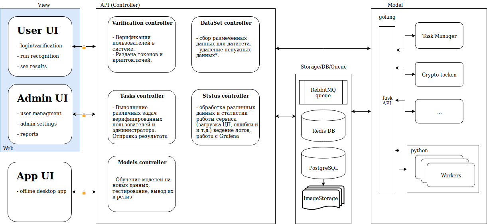

# Backend архитектурная схема

*рис 1. архитектурная схема*

## Описание ключевых фичей

- Фотографии хранятся без сжатия
- Имена фото - хешкод от метаданных фото (чтобы не путать и не дублировать фото)
- Соединение с сервером старт сессии и загрузка моделей только у верифицированных пользователей по ключу (токену)

## Стек технологий

- Docker + nvidia-docker
- golang + python
- ClickHouse DB + Storage для хранения изображений и описаний к ним
- RebbutMQ для сервера очередей